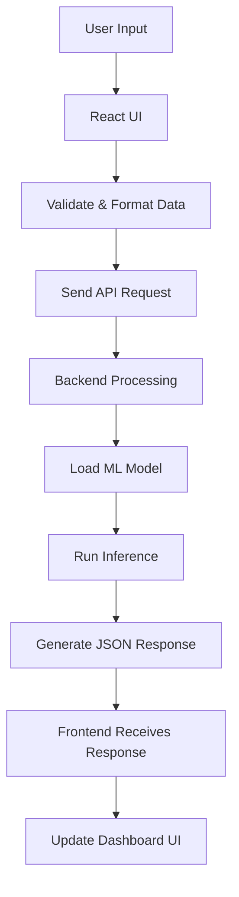
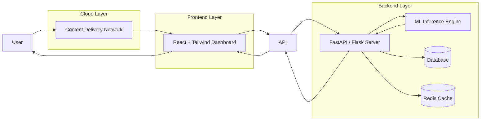
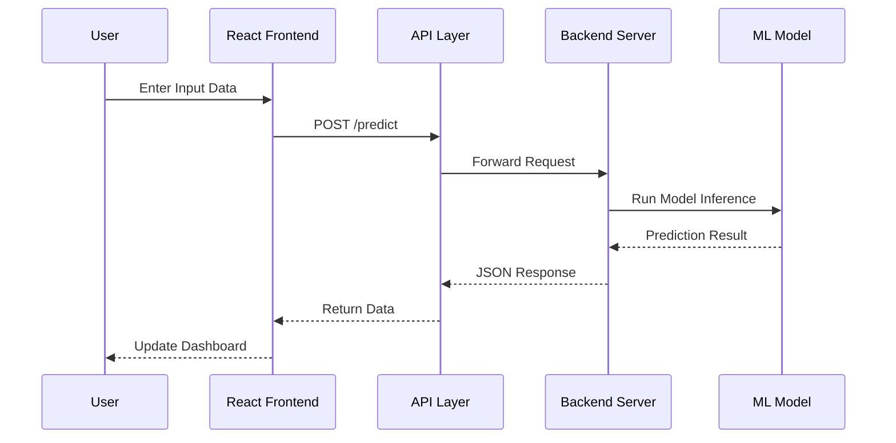
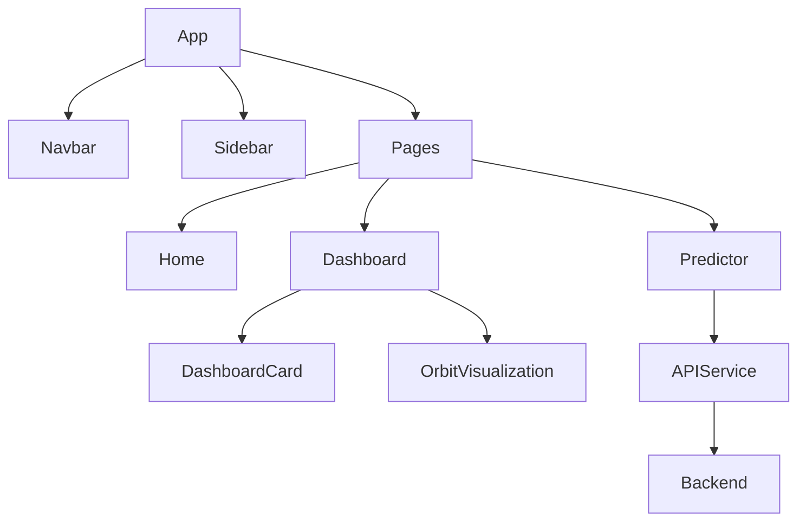

<p align="center">
  
</p>

<p align="center">
  <b>🚀 Space-Themed Interactive Web Dashboard with AI Integration</b>
</p>

<p align="center">
  
  
  
  
  
</p>

---

## 📌 Overview

OrbitXOS is a futuristic, space-inspired interactive web dashboard built using React, Vite, and Tailwind CSS.

It combines advanced frontend engineering with AI prediction integration capability in a modular and scalable architecture. The project demonstrates SaaS-style UI development with backend-ready ML integration.

---

## 🏗️ System Architecture

```mermaid
flowchart TD

    A[👤 User / Client Browser] --> B[⚛ React Frontend (Vite)]
    B --> C[🎨 UI Layer - Components]
    C --> D[📊 Visualization Layer]
    C --> E[🧠 AI Integration Layer]

    E --> F[🌐 API Service Layer]
    F --> G[🚀 Backend Server (FastAPI / Flask)]

    G --> H[📦 ML Model Loader]
    H --> I[🤖 Trained ML Model]
    I --> J[📤 Prediction Output]

    J --> G
    G --> F
    F --> E
    E --> C
    C --> B
    B --> K[⚡ Dynamic Dashboard Update]

    D --> K
```

---

## 🔄 End-to-End Processing Flow



---

## ☁️ Cloud Execution Flow



---

## 🔁 Request Lifecycle



---

## 🧩 Component Architecture



---

## 🚀 Development Status

OrbitXOS is actively maintained and continuously improved.

Ongoing improvements include:

- UI refinements  
- Performance optimization  
- API integration testing  
- Component refactoring  
- Animation enhancements  
- Codebase cleanup  

Regular commits are pushed to ensure consistent development and long-term scalability.

---

## ✨ Key Features

- 🚀 Space-themed animated dashboard  
- 🌌 Orbital visualization module  
- 🧠 AI predictor integration  
- ⚡ Fast development powered by Vite  
- 🎨 Fully responsive Tailwind CSS design  
- 🧩 Modular component-based architecture  
- 🔄 Backend-ready ML API structure  

---

## 🤖 Machine Learning Integration

OrbitXOS is designed to integrate seamlessly with backend ML services.

### ML Workflow

1. User inputs data  
2. Frontend sends request to backend API  
3. Backend loads trained ML model  
4. Model performs inference  
5. JSON response is returned  
6. Dashboard dynamically updates UI  

### Supported Backend Architectures

- FastAPI + PyTorch  
- Flask + Scikit-learn  
- Node.js + TensorFlow.js  
- Django REST + ML microservices  

---

## 📂 Project Structure

```
OrbitXOS/
│
├── public/
│   └── images/
├── src/
│   ├── components/
│   ├── pages/
│   ├── hooks/
│   ├── utils/
│   ├── App.jsx
│   └── main.jsx
├── index.html
├── package.json
├── vite.config.js
├── tailwind.config.js
├── postcss.config.js
└── README.md
```

---

## 🔐 Environment Variables

Create a `.env` file:

```
VITE_API_BASE_URL=http://localhost:8000
```

Access inside project:

```js
const baseURL = import.meta.env.VITE_API_BASE_URL;
```

---

## ⚙️ Installation & Setup

```bash
git clone https://github.com/shanky-ux/OrbitXOS.git
cd OrbitXOS
npm install
npm run dev
```

App runs at:

```
http://localhost:5173
```

---

## 🚀 Deployment

### 🔹 Vercel
- Build: `npm run build`
- Output: `dist`

### 🔹 Netlify
- Build: `npm run build`
- Publish: `dist`

---

## 📈 Future Enhancements

- 🌍 Real-time satellite tracking  
- 🛰 WebGL-based 3D orbital simulation  
- 🔐 Authentication system  
- 📊 AI analytics dashboard  
- 🌙 Dark/Light theme toggle  
- ☁️ Cloud backend integration  

---

## 🎯 Why This Project Stands Out

- Modern SaaS-level UI architecture  
- Clean modular React structure  
- Backend-ready AI integration  
- Scalable production configuration  
- Portfolio-ready professional presentation  

---

## 👨‍💻 Author

Ravi Shankar  
B.Tech Computer Science (AIML)  
Frontend Developer | AI Enthusiast  

GitHub: https://github.com/shanky-ux  

---

## 📜 License

This project is licensed under the MIT License.
